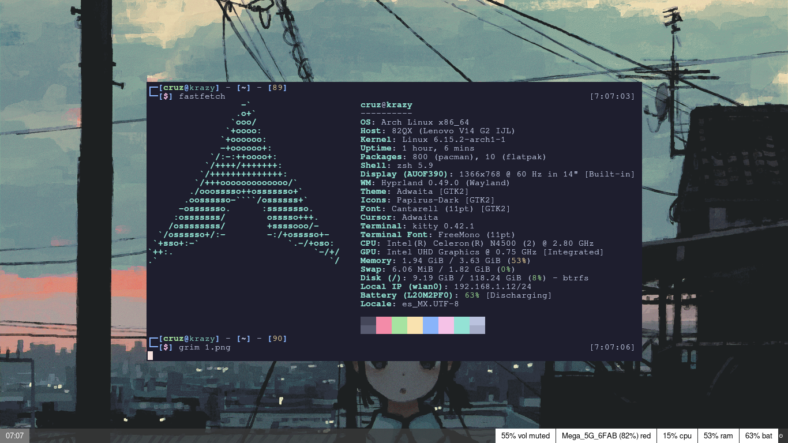

Bueno, en contexto pues esta configuracion solo se limita a alguna configuraciones que vienen por defecto. _Ademas, intento combinar el estilo gruvbox con algo gris con blanco_. 

En pocas palabras: _pues no es la gran cosa esta configuracion._

# ¿Como lo instalo?

- Haz git clone con: `git clone https://github.com/zhxnix77/myarchdotfiles_nose.git`
- Despues dirigite a la carpeta de **myarchdotfiles_nose**
- Entra en la carpeta **Config** y encontraras los archivos de configuracion
- Solo mueve los archivos a la carpeta **.config** o **/home/$USER/.config**

|App                    |Compatibilidad                    |
|--------------------|--------------------|
|**Hyprland**                    |Disponible en varias distros o se puede compilar                    |
|**Kitty**                   |Disponible en la mayoria de distros                    |
|**Waybar**                    |Disponible en la mayoria de distros                    |

